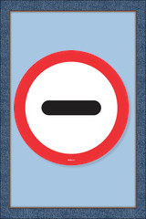
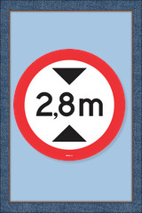
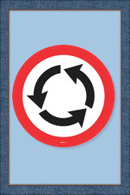
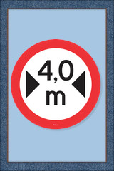
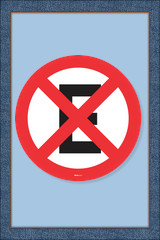
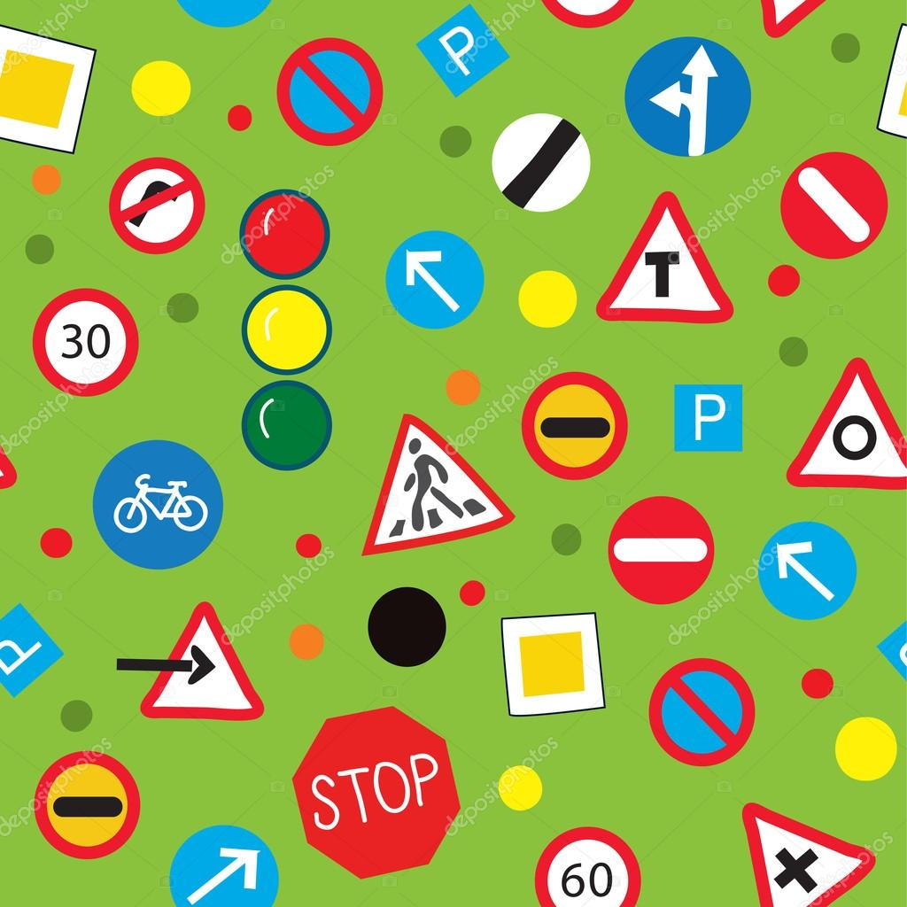

# Joga memória das Placas de Trânsito 
Um jogo educacional relacionado à educação no trânsito no que se refere as placas de trânsito,
foi desenvolvido como trabalho da matéria de multimídia, sendo feita toda da edição de imagens e áudios,
linguagens utilizadas Javascript,HTML e CSS. O jogo é composto de 3 fases .   
 
<a href="https://jogodasplacas.netlify.app/">Visualizar Site</a>
#
   

   

